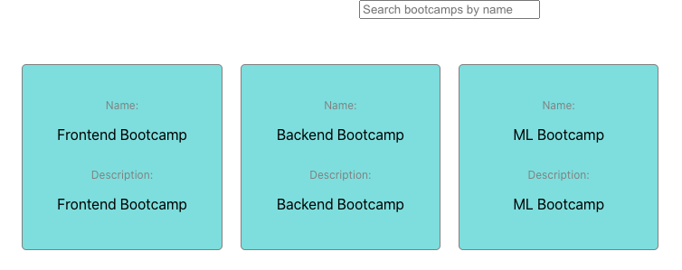
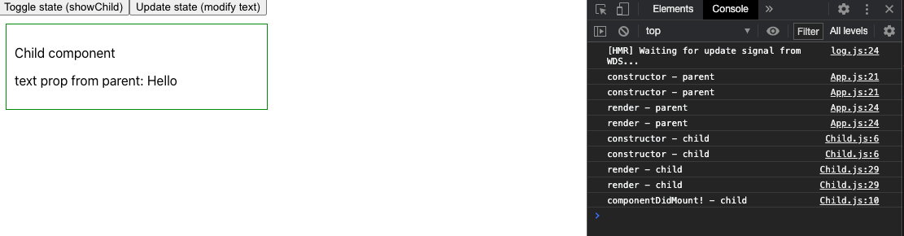
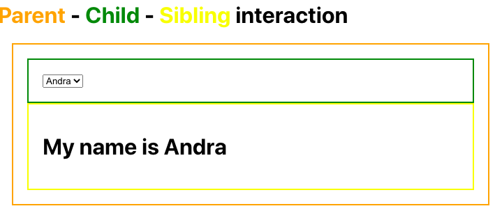
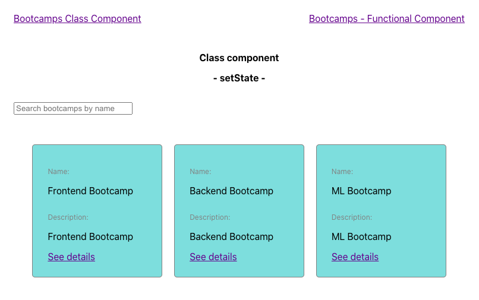
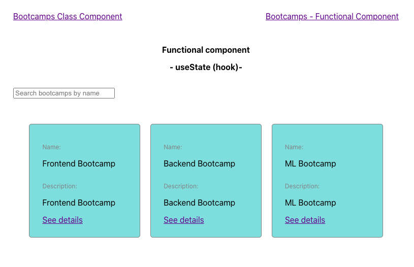
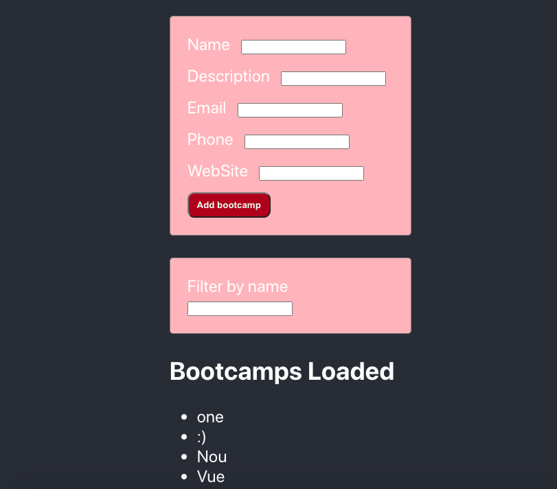
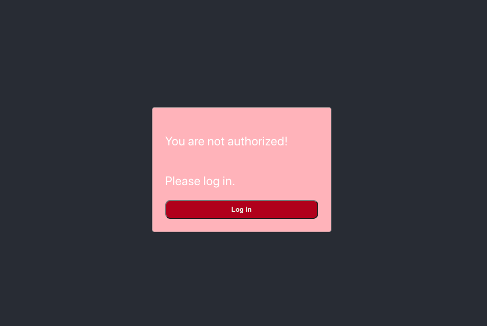

# Frontend Bootcamp with React

This project was bootstrapped with [Create React App](https://github.com/facebook/create-react-app).

## Installation

Clone the repository, change directories, and use NPM to install the dependencies.

```bash
$ git clone https://github.com/ecalimac/frontend-bootcamp-react-endv.git
$ cd frontend-bootcamp-react-endv
$ npm install
```

## Usage

The project can be run with

- `npm start`

The project can be viewed in the browser at

- [http://localhost:3000](http://localhost:3000)

## Course 1 
- initialize a new react app with npx
- create-react-app
- create-reacte-app’s folders and structure
- JSX
- functional vs. class components
- state and setState 
- *** Useful reminder: due to setState asynchronicity we can lookup for the new state with a 2nd parameter( a callback function)in setState passing props




## Course 2

- Lifecycle Methods
- https://projects.wojtekmaj.pl/-react-lifecycle-methods-diagram/
- Parent - Child interaction
- Child - Sibling interaction
- *** Useful Reminder:  for a ‘ghost’ node we can use either Fragment or … <> </>




## Course 3

- Routing
- Hooks: useState




## Course 4

- promises
- async await 
- add a loading spinner
- Forms and validation
- Rules of hooks

## Course 5

- React.memo
- Hooks: useEffect, useRef, useCallback



## Course 6

- Hooks: useReducer
- ContextApi

